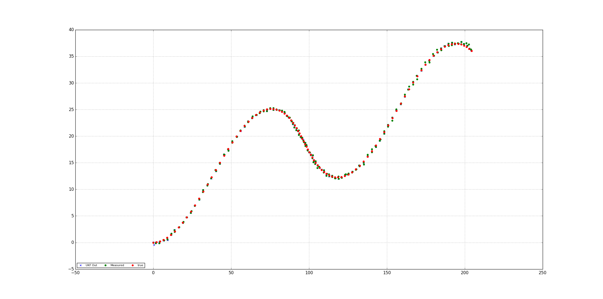

# Unscented Kalman Filter Project Starter Code
Self-Driving Car Engineer Nanodegree Program

---

## Dependencies

* cmake >= v3.5
* make >= v4.1
* gcc/g++ >= v5.4

## Basic Build Instructions

1. Clone this repo.
2. Make a build directory: `mkdir build && cd build`
3. Compile: `cmake .. && make`
4. Run it: `./UnscentedKF path/to/input.txt path/to/output.txt`. You can find
   some sample inputs in 'data/'.
    - eg. `./UnscentedKF ../data/sample-laser-radar-measurement-data-1.txt output.txt`

#### Formulas:
##### L14: Generate Sigma Points

##### L17: Augmentation

##### L21: Sigma Point prediction

##### L23: Predict Mean and Covariance

##### L26: Predict Radar measurements

##### L29:UKF Update

##### L31: Parameters and consistency (NIS)

## Resuls:

### Plot dataset #1

### Plot dataset #2

### Plot dataset zoom #2

### References:
[https://www.seas.harvard.edu/courses/cs281/papers/unscented.pdf](https://www.seas.harvard.edu/courses/cs281/papers/unscented.pdf)

### Data
The two data files that you will be using are the same from EKF. Again each line in the data file represents either a lidar or radar measurement marked by "L" or "R" on the starting line. The next following values are either the 2 lidar position measurements (x,y) or the 3 radar position measurements (rho, phi, rho_dot). The next value is then the time stamp and then finally the ground truth values for x, y, vx, vy.

### NOTE:
In Data 2, the starting lidar measurements for x, y are both zero, and this special case can create problems for both the EKF and UKF lidar update states. One way to catch for this is to observe when both px, py are zero and instead set them to some small floating value.
